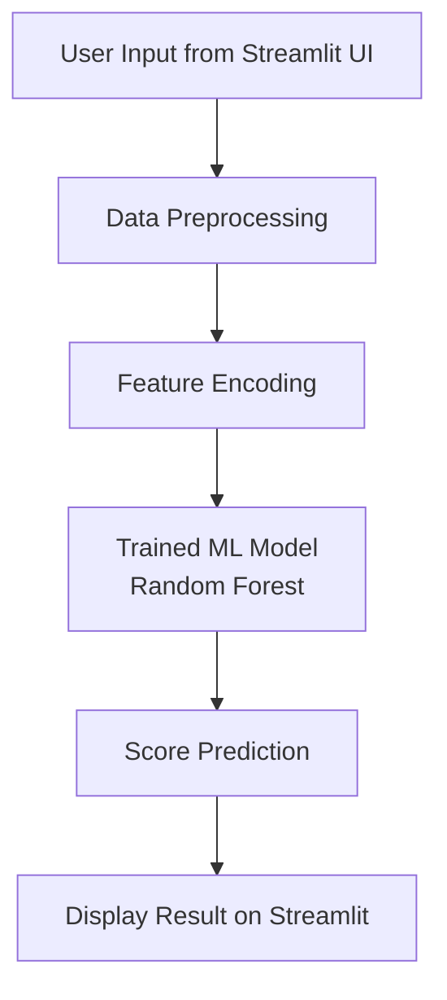

# 🏏 IPL First Innings Score Prediction Web App

A machine learning powered web application that predicts the final first-innings score of an IPL match based on real-time match conditions.

The app is built using Python, Scikit-Learn, and Streamlit and is deployed live on Streamlit Cloud.

---
## 🧠 System Architecture

## ⚙ Workflow

##  Live Demo

👉 https://liveiplscore.streamlit.app/

---

##  Features

 Predict IPL first innings total score  
 Interactive web interface (Streamlit)  
 Machine learning regression models  
 Match progress visualization (graphs)  
 Prediction history storage  
 Large ML model handled using Git LFS  
 Deployed online for public access  

---

## 📊 Input Parameters

- Batting Team  
- Bowling Team  
- Overs Completed  
- Current Runs  
- Wickets Fallen  
- Runs in Last 5 Overs  
- Wickets in Last 5 Overs  

---

##  Machine Learning Models Used

- Linear Regression  
- Decision Tree Regressor  
- Random Forest Regressor (Best Performing Model)  
- AdaBoost Regressor  

---

## Tech Stack

- Python  
- Pandas & NumPy  
- Scikit-Learn  
- Streamlit  
- Matplotlib  
- Git & Git LFS  
- Streamlit Community Cloud  

---

## 📁 Project Structure
IPL-Score-Predictor
│
├── data
│   └── ipl_dataset.csv
│
├── models
│   └── random_forest_model.pkl
│
├── notebooks
│   └── model_training.ipynb
│
├── app.py
│
├── train_model.py
│
├── requirements.txt
│
└── README.md
📈 Example Prediction
Parameter	Value
Batting Team	Mumbai Indians
Bowling Team	Chennai Super Kings
Overs Completed	10
Current Runs	85
Wickets Fallen	2
Runs in Last 5 Overs	45
Wickets in Last 5 Overs	1

🏏 Predicted Score: 178 Runs

🔮 Future Improvements

Deep Learning models

Real-time IPL API integration

Live match score prediction

Better UI/UX dashboard

Model performance comparison

